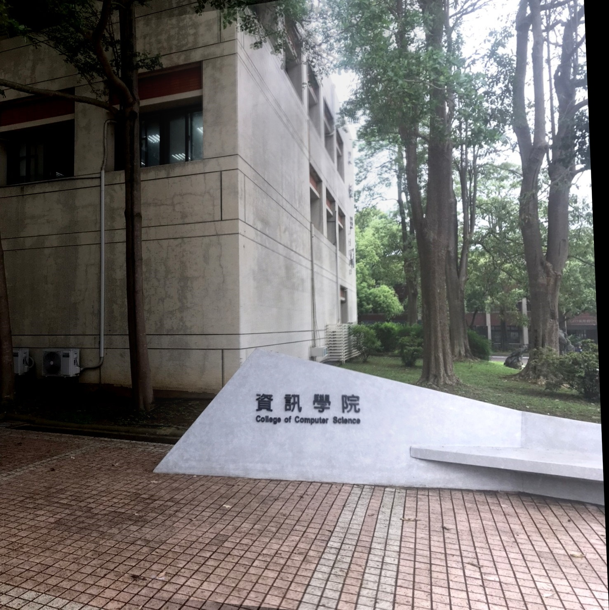
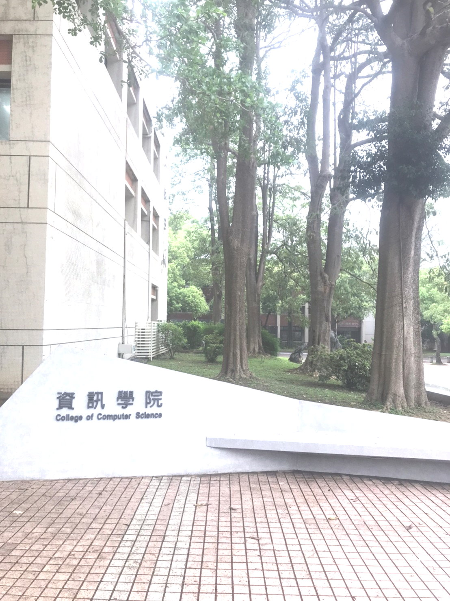
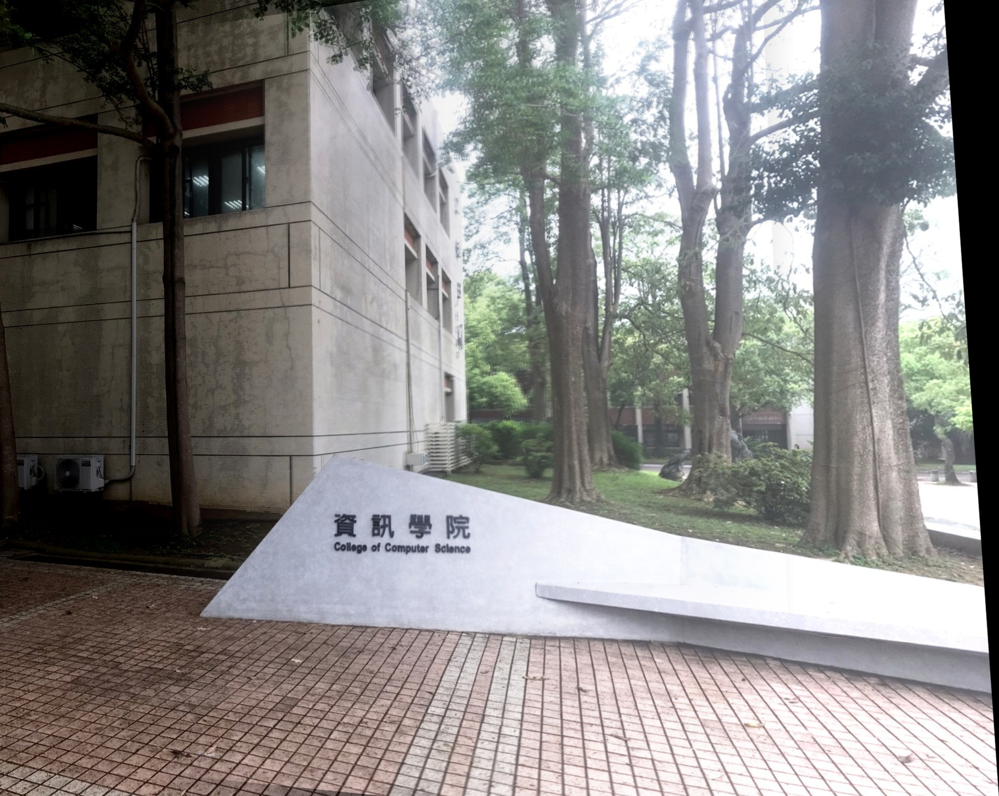

# SeamlessStitch:Feature Based Image Alignment

## Introduction

SeamlessStitch is an image stitching pipeline that leverages feature-based matching techniques to align and blend multiple images into a seamless panorama.  
The project implements SIFT feature extraction, KNN matching with Lowe’s ratio test, RANSAC for robust homography estimation, and multiple blending methods for smooth image fusion.


## Stitching Example (Demo)


<div style="display: flex; justify-content: center; align-items: center;">

  <div style="text-align: center; margin-right: 20px;">
    
    <p>Base1.jpg</p>
  </div>

  <div style="text-align: center; margin-right: 20px;">
    
    <p>Base2.jpg</p>
  </div>

  <div style="font-size: 40px; align-self: center;">
    ➔
  </div>

  <div style="text-align: center; margin-left: 20px;">
    
    <p>Stitched Output</p>
  </div>

</div>

## Features

- **SIFT Feature Detection**: Extract scale and rotation-invariant features.
- **KNN Matching with Lowe's Ratio Test**: Robust feature matching to filter outliers.
- **Homography Estimation with RANSAC**: Estimate transformation matrix even with noisy matches.
- **Image Blending**:
  - Linear alpha blending
  - Single (Affine-transformed) blending
- **Support for sequential multi-image stitching** (extendable)
- **Modular Code Structure** for easy maintenance and expansion.

---

## Usage
```
python src/main.py
```
The script will:

- Read two images from datasets/

- Perform feature matching and homography estimation

- Stitch the images together

You can modify src/main.py to stitch your own images by changing the image paths.

## 🚧 Known Issues and Future Improvements

- **Single Blending Limitation**:  
  The `single_blending` method currently cannot produce effective stitching results under all scenarios. Improvements to the warping and alignment process are needed to enhance robustness.

- **Color Difference Across Regions**:  
  Although basic gain compensation `(blending-create_mask)` has been applied to mitigate brightness and color inconsistencies between stitched regions, the current method offers only limited improvement. Significant color differences may still be visible in the final output.

If you are interested in improving these aspects or collaborating on further development, feel free to contact me. Contributions and suggestions are highly welcome!

## Contact

If you have any questions, feedback, or suggestions, feel free to reach out:

- GitHub Issues
- Email: jimmy454522@gmail.com